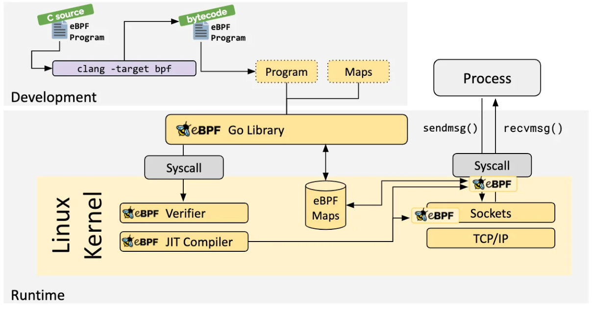
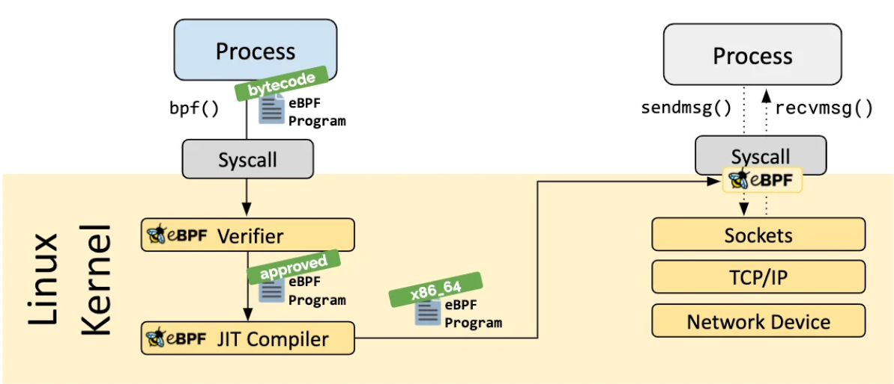
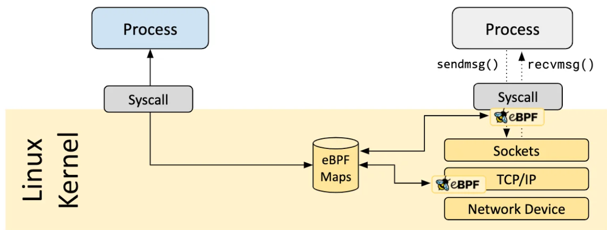
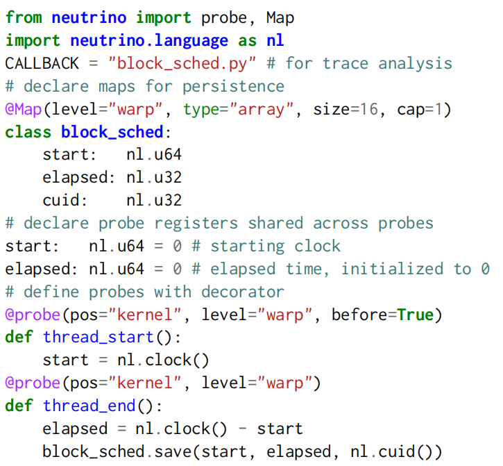
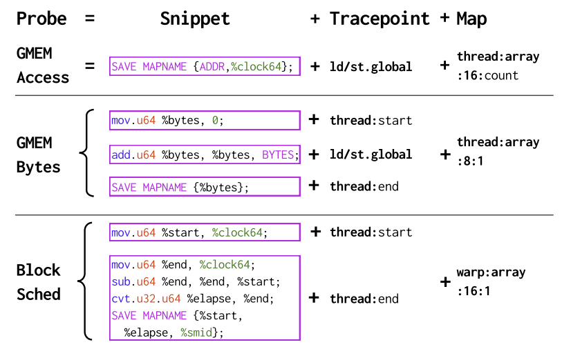
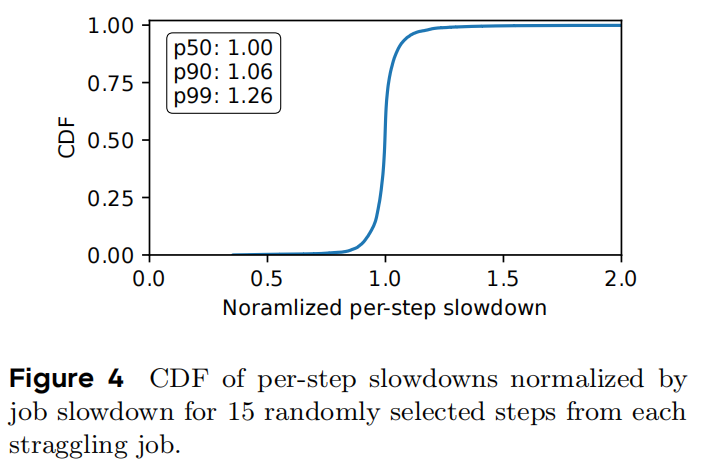
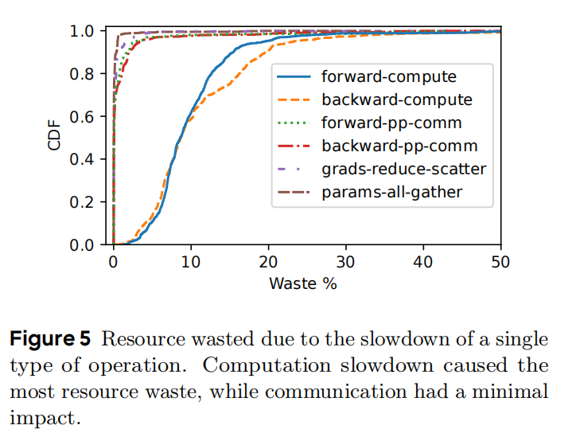
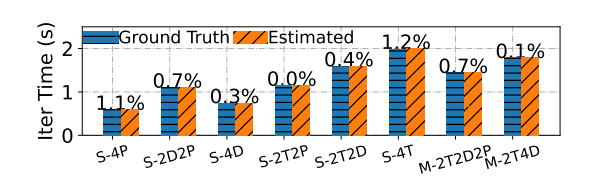
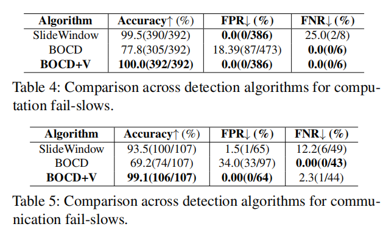
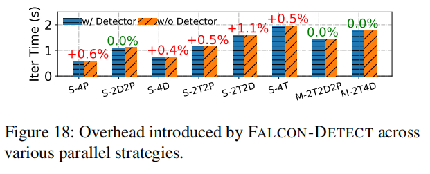

## eBPF 技术



### Workflow

- eBPF程序（受限的C/eBPF汇编）

```c
/* SPDX-License-Identifier: (LGPL-2.1 OR BSD-2-Clause) */
#define BPF_NO_GLOBAL_DATA
#include <linux/bpf.h>
#include <bpf/bpf_helpers.h>
#include <bpf/bpf_tracing.h>

typedef unsigned int u32;
typedef int pid_t;
const pid_t pid_filter = 0;

# 定义许可证，通常使用 "Dual BSD/GPL"
char LICENSE[] SEC("license") = "Dual BSD/GPL";

# 使用 SEC 宏把函数附加到 sys_enter_write
SEC("tp/syscalls/sys_enter_write")
int handle_tp(void *ctx)
{
 pid_t pid = bpf_get_current_pid_tgid() >> 32;
 if (pid_filter && pid != pid_filter)
  return 0;
 bpf_printk("BPF triggered sys_enter_write from PID %d.\n", pid);
 return 0;
}
```

- eBPF编译（LLVM/Clang）

- verifier校验 + JIT编译


- 程序挂载
- 获取eBPF程序输出信息
  - 简单输出:
    bpf_printk()
  - eBPF映射



```c
// 定义一个哈希表类型的 map，key 是 PID，value 是调用次数
struct {
    __uint(type, BPF_MAP_TYPE_HASH);
    __uint(max_entries, 1024);
    __type(key, u32);       // 进程 ID
    __type(value, u64);     // 次数
} syscall_count SEC(".maps");

SEC("tracepoint/syscalls/sys_enter_openat")
int count_openat(struct trace_event_raw_sys_enter* ctx) {
    u32 pid = bpf_get_current_pid_tgid() >> 32;
    u64 *val = bpf_map_lookup_elem(&syscall_count, &pid);
    u64 one = 1;
    if (val) {
        (*val)++;
    } else {
        bpf_map_update_elem(&syscall_count, &pid, &one, BPF_ANY);
    }

    return 0;
}

```

## Neutrino 设计


### Workflow

基于python DSL的探针定义



- 探针（对标eBPF程序）:
  
  - 支持自定义插桩逻辑的 snippet（对标自定义 eBPF 程序）
  - 指令级 tracepoint（对标内核hook）
  - thread/warp 级别的 ndarray（对标map）

- probe安全验证（对标verifiler）
- hook driver运行时注入（bpf()加载）

## 我们的compiler描述

三要素：采哪些数据、在哪采数据、如何存储

安全验证，不影响原始指令执行

非JIT，在mapping转换为instruction过程中插入

## Straggler

### Bytedance

不同step的slowdown情况



不同类型操作造成的资源浪费



### Alibaba

时间估计的准确性



检测算法准确性



时间开销

